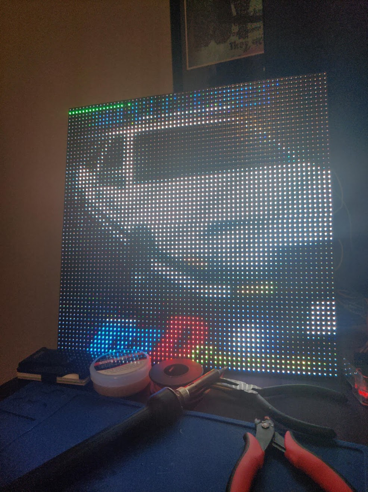

# SpotifyLEDDisplay
A Python Script for displaying your currently playing song onto your LED matri/x/(cies)
This is still very much a work in progress, current works in progress are refresh tokens and contrasting text for the track's title
# Project Requirements
1. 2x [64x32 led matricies](https://www.amazon.com/Pixels-Indoor-SMD2121-320x160mm-320160mm/dp/B07SDMWX9R/ref=sr_1_13?dchild=1&keywords=led+matrix&qid=1625464711&sr=8-13)
2. Power Supply for matricies [Power Supply](https://www.amazon.com/Aclorol-100V-240V-Switching-Converter-5-5x2-1mm/dp/B07CMM2BBR/ref=pd_bxgy_img_2/146-1323726-0501719?pd_rd_w=CMHid&pf_rd_p=fd3ebcd0-c1a2-44cf-aba2-bbf4810b3732&pf_rd_r=4AF6VZJKNY9ENC44MC3R&pd_rd_r=cec9a088-9c56-480d-889b-4cc5a54b2047&pd_rd_wg=YNy14&pd_rd_i=B07CMM2BBR&psc=1)
3. One RaspberryPi( I use the RPi 3 mostly because I have a few lying around but it's also nice not to have to run ethernet to it as well)
4. jumper wires for RPI GPIO header pins to the IN pins on the matricies
5. I would also reccomend a ribbon cable for connected the two matricies otherwise you can daisy chain some jumper wires
# Getting Setup
1. Refer to this link for setting up your wiring [hzeller's RPI GPIO LED controller]("https://github.com/hzeller/rpi-rgb-led-matrix")
2. Setup A SpotifyAPI app on Spotify's Developer Dashboard [link](https://developer.spotify.com/dashboard/login) Make sure to setup a redirect uri this will be http://(your raspberry pi's ip):5000/spotify/callback
3. Setup a Gmail Account for sending the SMS links for spotify verification, make sure to allow less secure apps on your account [link to allow less secure apps on account](https://myaccount.google.com/lesssecureapps?pli=1&rapt=AEjHL4NeLEa87kn7oADg8QKET5wKChEr3COo0nkk89SwN6HHzVgdOwI03N70kAUsXH7wKLbJU3xXEblU4fGfSEv59A_ozLKakQ)
4. Set enviornment variables for 
    * CLIENTID 
    * CLIENTSECRET
    * SMTP_EMAIL
    * SMTP_EMAIL_PASS
    * REDIRECT URI (set in step two)
5. set your sms_email in server.py line 98 simply put your number followed by the specified gateway address [link to all gateway addresses](https://kb.sandisk.com/app/answers/detail/a_id/17056/~/list-of-mobile-carrier-gateway-addresses)
6. install requirements by running ```pip3 install -r requirements.txt``` in the projcects root
7. Finally run ```python3 server.py``` in the project's root

You should recieve a text to your cellphone for the OAuth, which will then, if verified, start requesting your currently playing track's info and start displaying on the Matrix

# Example pictures




